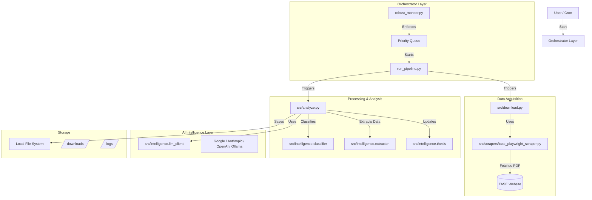

# System Architecture

## Overview
The **Financial Data Pipeline** is an automated system designed to scrape, download, analyze, and extract insights from financial reports of renewable energy companies listed on the Tel Aviv Stock Exchange (TASE). It employs a robust, multi-provider AI architecture (Google Gemini, Anthropic Claude, OpenAI GPT, Ollama) to process documents and generate investment memos and financial models.

## High-Level Architecture

## Component Breakdown

### 1. Orchestration & Monitoring
*   **`run_pipeline.py`**: The CLI entry point. Manages the sequential execution of downloading and analyzing. Handles argument parsing (`--company`, `--provider`, `--year`).
*   **`robust_monitor.py`**: A daemon process that ensures system reliability.
    *   **Priority Queue**: Enforces execution order (e.g., Sofwave > Apollo).
    *   **Auto-Recovery**: Detects stalled processes (>10 min inactivity) and restarts them.
    *   **Concurrency Control**: Ensures only one AI pipeline runs at a time to optimize resource usage.

### 2. Data Acquisition
*   **`src/download.py`**: Coordinates the download process. Checks for existing files to avoid redundancy.
*   **`src/scrapers/tase_playwright_scraper.py`**: A headless browser scraper (Playwright) that interacts with the TASE "Maya" system to find reports, handle pagination, and download PDFs.

### 3. Core Processing (`src/analyze.py`)
The heart of the system. It processes downloaded PDFs file-by-file:
1.  **Classification**: Determines if a file is a Financial Report, Press Release, or Irrelevant.
2.  **Extraction**: Extracts key financial metrics (Revenue, Net Income, EBITDA) using LLMs.
3.  **Thesis Generation**: Updates a running "Investment Memo" markdown file based on new information.
4.  **File Management**: Moves processed files into `Financials/` or `Others/` subfolders.

### 4. Intelligence Layer (`src/intelligence/`)
*   **`llm_client.py`**: A unified wrapper for multiple AI providers.
    *   **Fallback Mechanism**: Automatically retries with a different provider (e.g., Google -> Ollama) if the primary fails (rate limits, 500 errors).
    *   **Cost Management**: Allows switching between "Flash" (fast/cheap) and "Pro" models.
*   **`classifier.py`**: specialized prompt logic for document classification.
*   **`extractor.py`**: specialized prompt logic for JSON data extraction.

### 5. Monitoring Tools
*   **`monitor_progress.py`**: A real-time terminal UI showing file counts, active status, and current AI model.
*   **`check_status.py`**: A quick diagnostic tool to check API key validity and process PIDs.
*   **`verify_completion.py`**: Validates that critical output files (`Investment_Memo.md`, `Financial_Model.csv`) exist and are non-empty.
*   **`compare_models.py`**: Benchmarks the processing speed (docs/hour) of different models/providers.

## Directory Structure
*   `downloads/`: Raw and processed PDF files, organized by Company/Year.
*   `src/`: Source code.
*   `venv/`: Python virtual environment.
*   `*.log`: Application logs (one per pipeline).

## Data Flow
1.  **Input**: User specifies a company (e.g., "Sofwave").
2.  **Scrape**: System scrapes TASE for all PDFs from 2021-present.
3.  **Download**: PDFs are saved to `downloads/Sofwave_Medical/YYYY/`.
4.  **Analyze**:
    *   PDF is uploaded to context window (or parsed to text).
    *   LLM classifies document.
    *   LLM extracts JSON data.
5.  **Output**:
    *   Data appended to `Financial_Model.csv`.
    *   Insights added to `Investment_Memo.md`.
    *   PDF moved to `downloads/Sofwave_Medical/YYYY/Financials/`.
